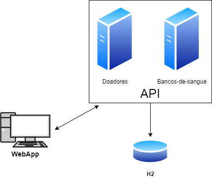

# 37SCJ-ApiHemocentro
Projeto para disciplina WEBSERVICES &amp; RESTFUL TECHNOLOGIES (FIAP)

Projeto criado com objetivo de aproximar doadores de sangue e bancos de sangue. 

##  Pré-requisitos para execução do projeto
- Tecnologias necessárias.

  1- Para executar os projetos é necessário ter instalado Java SE Development Kit versão 11 e o Node JS.
  
  2- Utilizar uma IDE para execução dos projetos de API desenvolvida em Java. Ex. IntelliJ ou Eclipse.
  
  3- Utilizar uma IDE para execução do projeto WebApp desenvolvida em React. Ex. VS Code.
  
  ---
## Topologia

---

## Download do projeto

- Baixar o projeto: `$ git clone https://github.com/igor-fga/37SCJ-ApiHemocentro.git`

---

## Instruções execução dos projetos

### 1) Instalação e execução do projeto Api
Esse projeto tem como objetivo criação, edição, busca e deleção de doadores e bancos de sangue.

- Importar o projeto (Ex. Eclipse)

  1- No Eclipse, selecione **File > Import...**.
  
  2- Na janela de importação, expandir Maven, selecione **Existing Maven Projects**, e clicar **Next**.
  
  3- Clicar em **Browse** e entre na pasta do projeto **Api**, onde contém o **pom.xml** que você deseja importar.
  
  4- Clicar em **Finish**. O Eclipse vai importar o projeto e iniciar o download dos recursos requeridos.
  
  5- Entre no Package **br.com.fiap.ApiBancoDeSangue** e clique na classe Java **ApiBancoDeSangueApplication** e clique em **Run**.
  
  6- Os serviços podem ser testados utilizando o swagger no endereço *http://localhost:8081/swagger-ui/index.html*

### 2) Instalação e execução do projeto WebApp
Esse projeto tem como objetivo uma aplicação web para inserir e buscar por doadores e bancos de sangue.

- Importar o projeto (Ex. VS Code)

  1- No VS Code, selecione **File > Open Folder...**.
  
  2- Entre na pasta do projeto **WebApp** e clique em selecionar pasta.
  
  3- Abra uma nova janala de terminal **Terminal > New Terminal**.
  
  4- Digite o comando `npm install`, esse comando é utilizado para instalação de todas as dependencias do projeto.
  
  5- Digitar o comando `npm start`, esse comando irá iniciar aplicação no endereço **http://localhost:3000**.
